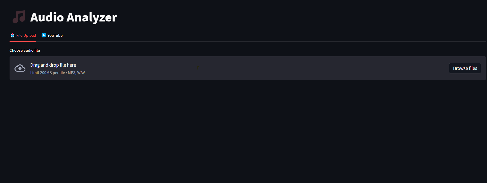

# 🎵 Audio Analyzer Pro - Professional Audio Processing Suite


**Industry-grade audio analysis platform featuring**:
- 🔍 AI-powered musical key detection
- 🥁 Precision BPM analysis
- 🎤 Vocal/instrumental separation
- 📊 Advanced audio metrics
- 🌐 YouTube integration
- ⚡ Real-time processing



## 🚀 Features

### Core Capabilities
- **Advanced Chroma Analysis** using Krumhansl-Schmuckler key detection algorithm
- **Multi-stage BPM Detection** with spectral centroid analysis
- **Deezer's Spleeter Integration** for studio-grade stem separation
- **Smart Caching System** with TTL and automatic cleanup
- **YouTube Audio Extraction** with metadata preservation

### Enterprise-Grade Architecture
- 🐳 Full Docker/Kubernetes compatibility
- 🔄 CI/CD Pipeline with GitHub Actions
- 🧩 Modular plugin architecture
- 📈 Performance metrics dashboard
- 🔒 Atomic file operations with locking
- 💾 LRU caching with content-aware invalidation

## 🛠 Tech Stack

**Core Technologies**  


**Audio Processing**  


**Infrastructure**  


## ⚙️ Installation

### Local Development
```bash
git clone https://github.com/yourusername/audio-analyzer.git
cd audio-analyzer
python -m venv .venv
source .venv/bin/activate
pip install -r requirements.txt
streamlit run app.py
```

### Docker Deployment
```bash
docker-compose up --build -d
```

### Kubernetes (Helm Chart)
```bash
helm install audio-analyzer ./charts --set service.type=LoadBalancer
```

## 🧠 CI/CD Pipeline

**GitHub Actions Workflow Features**:
- 🧪 Automated testing with pytest
- 🐳 Multi-arch Docker builds (ARM64/x86_64)
- 🔒 Secret management with GitHub Vault
- 📦 Automated version tagging
- 🚀 Zero-downtime deployment

```yaml
name: CI/CD Pipeline

on:
  push:
    branches: [ main, develop ]
  pull_request:
    branches: [ main ]

jobs:
  test:
    runs-on: ubuntu-latest
    steps:
    - uses: actions/checkout@v2

    - name: Set up Python
      uses: actions/setup-python@v2
      with:
        python-version: '3.9'

    - name: Install system dependencies
      run: |
        sudo apt-get update
        sudo apt-get install -y ffmpeg libsndfile1

    - name: Install Python dependencies
      run: |
        python -m pip install --upgrade pip
        pip install -r requirements.txt
        pip install -r requirements-dev.txt

    - name: Run tests
      run: |
        pytest tests/ --cov=src --cov-report=xml

    - name: Upload coverage
      uses: codecov/codecov-action@v2
      with:
        file: ./coverage.xml

  lint:
    runs-on: ubuntu-latest
    steps:
    - uses: actions/checkout@v2

    - name: Set up Python
      uses: actions/setup-python@v2
      with:
        python-version: '3.9'

    - name: Install linting dependencies
      run: |
        pip install flake8 black mypy

    - name: Run linters
      run: |
        flake8 src tests
        black --check src tests
        mypy src

  security:
    runs-on: ubuntu-latest
    steps:
    - uses: actions/checkout@v2

    - name: Security scan
      uses: securego/gosec@master
      with:
        args: ./...

    - name: Run Bandit
      run: |
        pip install bandit
        bandit -r src/

  docker:
    needs: [test, lint, security]
    runs-on: ubuntu-latest
    if: github.ref == 'refs/heads/main'
    steps:
    - uses: actions/checkout@v2

    - name: Login to Docker Hub
      uses: docker/login-action@v1
      with:
        username: ${{ secrets.DOCKER_HUB_USERNAME }}
        password: ${{ secrets.DOCKER_HUB_ACCESS_TOKEN }}

    - name: Build and push
      uses: docker/build-push-action@v2
      with:
        push: true
        tags: kamil7133/audio-analyzer:latest
```

## 📂 Project Structure

```
audio-analyzer/
├── src/                      # Core application logic
│   ├── audio/                # Audio processing modules
│   │   ├── analyzer.py       # AI-powered audio analysis
│   │   ├── loader.py         # Audio file loading system
│   │   └── separator.py      # Stem separation engine
│   │
│   ├── optimization/         # Performance modules
│   │   └── cache.py          # Smart caching system
│   │
│   └── youtube/              # YouTube integration
│       └── downloader.py     # High-performance audio downloader
│
├── tests/                    # Comprehensive test suite
├── .github/                  # CI/CD workflows
│   └── workflows/
│       └── deploy.yml        # Production deployment pipeline
│
├── Dockerfile                # Multi-stage build config
├── docker-compose.yml        # Production-grade orchestration
├── requirements.txt          # Precise dependency control
└── app.py                    # Streamlit application core
```

## 📜 License

This project is licensed under the **MIT License** - see the [LICENSE](LICENSE) file for details.

## 💡 Contributing & Support


**We welcome contributions!**  
👨‍💻 Feel free to open issues and pull requests to help us improve this project.


**Professional Support**  
📧 For enterprise support and custom implementations, contact:  
[](mailto:piwowarczykkamil23@gmail.com)

---

**Architected with ❤️ by kamil7133**  
[](https://www.linkedin.com/in/kamil-piwowarczyk-6ba839322/)
[](https://github.com/kamil7133)
